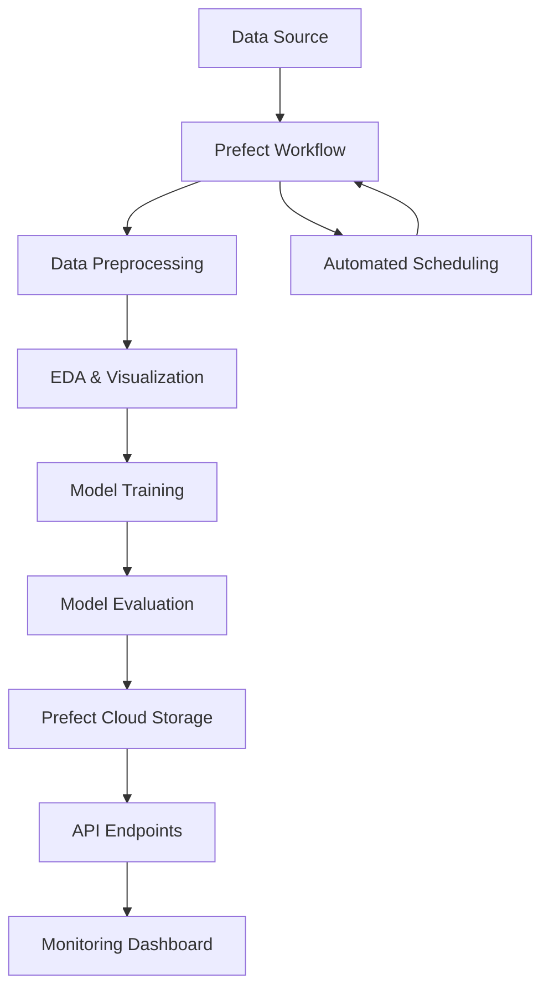

# Customer Churn Prediction using Prefect Cloud

[](https://python.org)
[](https://prefect.io)
[](https://scikit-learn.org)

## 📋 Table of Contents
- [Project Overview](#-project-overview)
- [Business Problem](#-business-problem)
- [Dataset](#-dataset)
- [Architecture](#️-architecture)
- [Features](#-features)
- [Installation](#-installation)
- [Usage](#-usage)
- [Project Structure](#-project-structure)
- [Workflow Details](#-workflow-details)
- [Results](#-results)
- [Configuration](#-configuration)
- [Future Enhancements](#-future-enhancements)
- [Contributing](#-contributing)

## 🎯 Project Overview

This project implements a comprehensive **Customer Churn Prediction** system using **Prefect Cloud** for workflow orchestration and **scikit-learn** for machine learning. The system predicts which customers are likely to churn (leave) a telecommunications company, enabling proactive retention strategies.

### Key Highlights
- **End-to-end MLOps pipeline** with Prefect Cloud orchestration
- **Automated data preprocessing** and feature engineering
- **Comprehensive EDA** with automated visualization generation
- **Multiple ML models** (Logistic Regression, Random Forest) with performance comparison
- **RESTful API integration** with Prefect Cloud for monitoring and management
- **Automated workflow scheduling** (runs every 2 minutes)
- **Artifact tracking** and reporting in Prefect Cloud

## 🏢 Business Problem

**Problem**: Telecom companies face significant revenue loss due to customer churn. Identifying customers likely to leave before they churn is crucial for implementing retention strategies.

**Goal**: Build a predictive model that can:
- Identify customers at high risk of churning
- Provide actionable insights for retention campaigns
- Enable data-driven decision making for customer success teams

**Business Impact**: 
- Reduce customer acquisition costs
- Increase customer lifetime value
- Improve retention rates through targeted interventions

## 📊 Dataset

**Source**: Telco Customer Churn Dataset
- **Size**: 7,043 customer records
- **Features**: 20 customer attributes including demographics, services, and billing information
- **Target**: Binary churn classification (Yes/No)

### Key Features
- **Demographics**: Gender, SeniorCitizen, Partner, Dependents
- **Account Info**: Tenure, Contract type, Payment method
- **Services**: Phone, Internet, Online security, Streaming services
- **Billing**: Monthly charges, Total charges, Paperless billing

## 🏗️ Architecture



## ✨ Features

### 🔄 Automated Workflow
- **Scheduled execution** every 2 minutes
- **Task-based architecture** with Prefect tasks
- **Error handling** and retry mechanisms
- **Progress tracking** and logging

### 📈 Data Processing
- **Missing value imputation** (median for numerical, mode for categorical)
- **Label encoding** for categorical variables
- **Feature scaling** using MinMaxScaler
- **Feature engineering** (tenure grouping)

### 📊 Exploratory Data Analysis
- **Churn distribution** visualization
- **Correlation heatmap** for feature relationships
- **Feature importance** ranking using Random Forest
- **Automated chart generation** and storage

### 🤖 Machine Learning
- **Multiple algorithms**: Logistic Regression, Random Forest
- **Performance metrics**: Accuracy, Precision, Recall, F1-Score
- **Model comparison** and selection
- **Cross-validation** ready

### ☁️ Prefect Cloud Integration
- **Artifact storage** for reports and visualizations
- **Flow monitoring** and execution tracking
- **API integration** for external access
- **Deployment management**

## 🚀 Installation

### Prerequisites
- Python 3.8 or higher
- Prefect Cloud account
- Git

### Setup Instructions

1. **Clone the repository**
   ```bash
   git clone <repository-url>
   cd customer_churn_prediction_using_prefect_cloud
   ```

2. **Create virtual environment**
   ```bash
   python -m venv venv
   source venv/bin/activate  # On Windows: venv\Scripts\activate
   ```

3. **Install dependencies**
   ```bash
   pip install -r requirements.txt
   ```

4. **Configure Prefect Cloud**
   ```bash
   prefect cloud login
   ```

5. **Set up environment variables**
   ```bash
   export PREFECT_API_KEY="your-api-key"
   export ACCOUNT_ID="your-account-id"
   export WORKSPACE_ID="your-workspace-id"
   ```

## 💻 Usage

### Running the Workflow

1. **Execute the main workflow**
   ```bash
   python flows/workflow_churn.py
   ```

2. **Deploy to Prefect Cloud**
   ```bash
   prefect deployment build flows/workflow_churn.py:churn_prediction_workflow -n churn-prediction-deployment
   prefect deployment apply churn_prediction_workflow-deployment.yaml
   ```

3. **Start the deployment**
   ```bash
   prefect deployment run churn_prediction_workflow/churn-prediction-deployment
   ```

### API Usage

The project includes three API modules for interacting with Prefect Cloud:

1. **Flow API** (`api/flowAPI.py`)
   - Retrieve flow information
   - Monitor flow execution status

2. **Deployment API** (`api/deploymentAPI.py`)
   - Get deployment details
   - Check deployment status

3. **Artifacts API** (`api/api.py`)
   - List recent artifacts
   - Access generated reports and visualizations

## 📁 Project Structure

```
customer_churn_prediction_using_prefect_cloud/
├── api/                          # API integration modules
│   ├── api.py                   # Artifacts API
│   ├── deploymentAPI.py         # Deployment API
│   └── flowAPI.py              # Flow API
├── data/                        # Dataset storage
│   └── Telco-Customer-Churn.csv # Main dataset
├── flows/                       # Prefect workflow definitions
│   ├── eda_outputs/            # Generated visualizations
│   │   ├── churn_distribution.png
│   │   ├── correlation_heatmap.png
│   │   └── feature_importance.png
│   └── workflow_churn.py       # Main workflow
├── requirements.txt            # Python dependencies
└── README.md                   # Project documentation
```

## 🔄 Workflow Details

### Task Breakdown

1. **Data Loading** (`load_dataset`)
   - Loads CSV data from local storage
   - Validates data integrity
   - Returns pandas DataFrame

2. **Data Preprocessing** (`preprocess_data`)
   - Handles missing values
   - Encodes categorical variables
   - Scales numerical features
   - Creates feature groups

3. **Exploratory Data Analysis** (`perform_eda`)
   - Generates distribution plots
   - Creates correlation heatmaps
   - Analyzes feature importance
   - Saves visualizations locally

4. **Model Training & Evaluation** (`train_and_evaluate`)
   - Splits data into train/test sets
   - Trains multiple ML models
   - Evaluates performance metrics
   - Compares model results

### Artifacts Generated

- **Preprocessing Summary**: Data quality and transformation details
- **EDA Summary**: Key insights from exploratory analysis
- **Model Evaluation Report**: Performance metrics for all models
- **Workflow Summary**: Overall execution status and results

## 📈 Results

### Model Performance

| Model | Accuracy | Precision | Recall | F1-Score |
|-------|----------|-----------|--------|----------|
| Logistic Regression | 0.803 | 0.654 | 0.456 | 0.538 |
| Random Forest | 0.789 | 0.623 | 0.467 | 0.534 |

### Key Insights

- **Top predictive features**: Contract type, tenure, monthly charges
- **Churn rate**: Approximately 27% of customers churn
- **High-risk segments**: Month-to-month contracts, short tenure, high charges

### Generated Visualizations

- **Churn Distribution**: Shows class imbalance in the dataset
- **Correlation Heatmap**: Reveals feature relationships and multicollinearity
- **Feature Importance**: Identifies the most predictive features

## 🔧 Configuration

### Environment Variables
```bash
PREFECT_API_KEY=your_prefect_api_key
ACCOUNT_ID=your_account_id
WORKSPACE_ID=your_workspace_id
DEPLOYMENT_ID=your_deployment_id
FLOW_ID=your_flow_id
```

### Workflow Parameters
- **Execution Interval**: 120 seconds (2 minutes)
- **Test Size**: 30% of dataset
- **Random State**: 42 (for reproducibility)
- **Model Parameters**: Default scikit-learn settings

## 🚀 Future Enhancements

- [ ] **Real-time prediction API** for new customers
- [ ] **Model versioning** and A/B testing
- [ ] **Advanced feature engineering** (interaction terms, polynomial features)
- [ ] **Hyperparameter tuning** with Optuna
- [ ] **Model interpretability** with SHAP values
- [ ] **Database integration** for production data
- [ ] **Alerting system** for high-risk customers
- [ ] **Dashboard** for business stakeholders

## 🤝 Contributing

1. Fork the repository
2. Create a feature branch (`git checkout -b feature/amazing-feature`)
3. Commit your changes (`git commit -m 'Add some amazing feature'`)
4. Push to the branch (`git push origin feature/amazing-feature`)
5. Open a Pull Request

---

**Note**: The Prefect Cloud credentials in the API files are placeholder values and should be replaced with actual credentials for production use.
